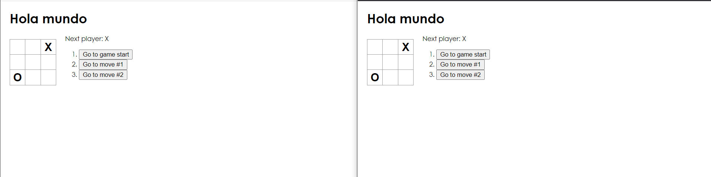

# Autor: Daniel Felipe Alfonso Bueno
# Profesor: Luis Daniel Benavides
# ARSW - Arquitectura de Software 2020-I 

## Descripción
En este proyecto, se implementará el juego clásico Tic Tac Toe (Triki), donde se podrá elegir una sala de juego, si no existe crearla e ingresar a los jugadores. Permite volver a un estado anterior del juego además de poder jugar con normalidad al juego. 

[¡Link de la aplicación desplegada en Heroku!](https://radiant-savannah-21856.herokuapp.com/index1.html)

## Prerrequisitos 
Instalación de JAVA 8 y Maven, manejo de Maven como administrador proyectos y librerías y JAVA OO

## Diseño 
### Diagrama de Componentes

### Descripción 
En este diagrama podemos observar, como realizan las solicitudes los clientes que en este caso serán los navegadores los cuales se implementaron con React JS donde se realizo el juego de Tictac Toe además hacen peticiones a un EndPoint exactamente a una sala o crear una sala en SpringMVC que será el encargado de manejar las sesiones de los usuarios, la administración de las salas y configuración de persistencia de historial, para volver a un punto anterior, que se manejara en MongoDB.

## Uso del Proyecto 
Clonamos nuestro proyecto desde GitHub
~~~
git clone https://github.com/DanielAlfonso17/ARSWLAB7.git
~~~
Abrimos con una IDE nuestro proyecto, como primera forma podremos ejecutarlo asi 

También podemos ejecutarlo desde la línea de comandos CMD de la siguiente manera, primero lo compilamos con el comando 
~~~
mvn package
~~~

después ejecutamos con el comando 
~~~
mvn spring-boot:run
~~~

Podemos observar que ya está corriendo nuestra aplicación por el puerto 8080 procedemos en el navegador a escribir 

~~~
localhost:8080
~~~

Obtendremos como resultado la página de inicio del juego, así como se muestra. En esta primera pantalla, debemos ingresar la sala que queremos entrar o crear. 

Para el ejemplo, ingresaremos a la misma sala uno en la barra de navegación podemos observar que cambia la ruta por la de la sala 

Realizamos un movimiento en el tablero en cada navegador y se actualizara en el otro 

Ahora como ejemplo creamos la sala dos y tres como vemos en el navegador y no cambia el juego ya que esta en sala diferente

